<div align="center">


<h1>Azure Enterprise Landing Zone Starter</h1>

<p><strong>Secure, Scalable, Policy-Driven Multi-Subscription Cloud Foundation for Global Organizations</strong></p>

[](https://devopstrio.co.uk/)
[](https://devopstrio.co.uk/)
[](https://devopstrio.co.uk/)
[](/apps/governance-engine)

</div>

---

## 🏛️ Executive Summary

The **Azure Enterprise Landing Zone Starter** is a flagship platform designed to architect and deliver a world-class cloud foundation for large-scale organizations. Transitioning to Azure at scale requires more than just resource creation; it demands a strategic alignment of **governance**, **networking**, **identity**, and **security** within a multi-subscription hierarchy. This platform codifies the **Microsoft Cloud Adoption Framework (CAF)** and **Azure Landing Zone (ALZ)** principles into a production-ready repository.

By leveraging sophisticated **Governance, Subscription, and Network Engines**, the platform automates the deployment of secure hub-spoke topologies, enforces global compliance through **Azure Policy-as-Code**, and manages the entire lifecycle of subscription vending. It provides a boardroom-ready Command Tower that gives platform engineering teams real-time visibility into governance drift, network health, and multi-region cost distribution, ensuring a secure and optimized cloud estate from the first subscription.

### Strategic Business Outcomes
- **Rapid Readiness at Scale**: Deploy a fully governed cloud foundation in hours, enabling business units to onboard workloads faster without compromising security.
- **Automated Governance-as-Code**: Prevent compliance drift through automated Azure Policy enforcement, tagging standards, and resource name validation.
- **Enterprise-Grade Networking**: Standardize connectivity through automated Hub-Spoke deployments, Private DNS management, and Private Endpoint readiness.
- **Optimized Cloud Economics**: Implement granular budget controls and cost attribution from day one, allowing for transparent chargeback and finance alignment.

---

## 🏗️ Technical Architecture Details

### 1. High-Level Azure Foundation Architecture
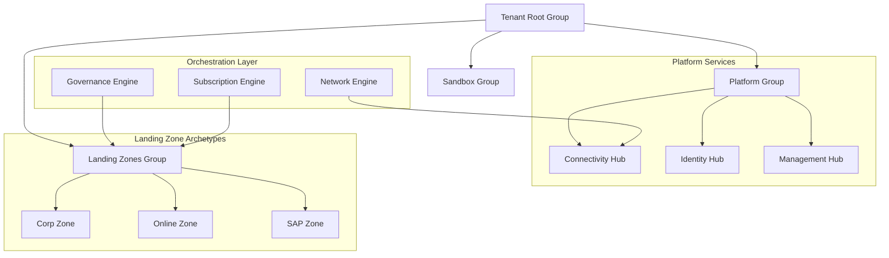

### 2. Subscription Vending Workflow
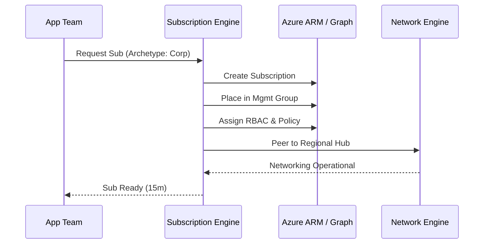

### 3. Management Group Hierarchy
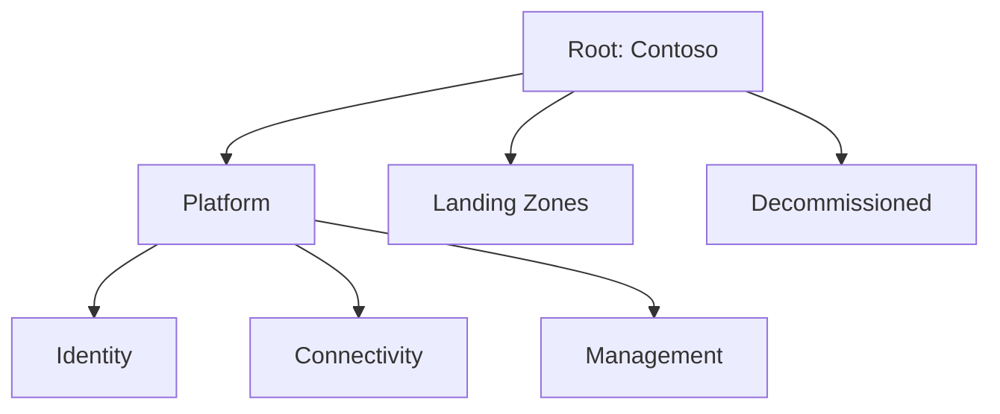

### 4. Policy Enforcement Lifecycle
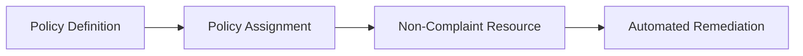

### 5. Hub-Spoke Topology
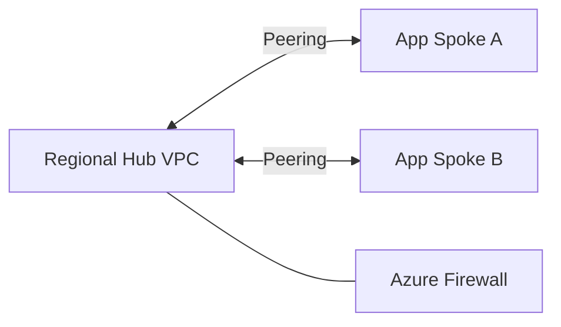

### 6. Security Trust Boundary
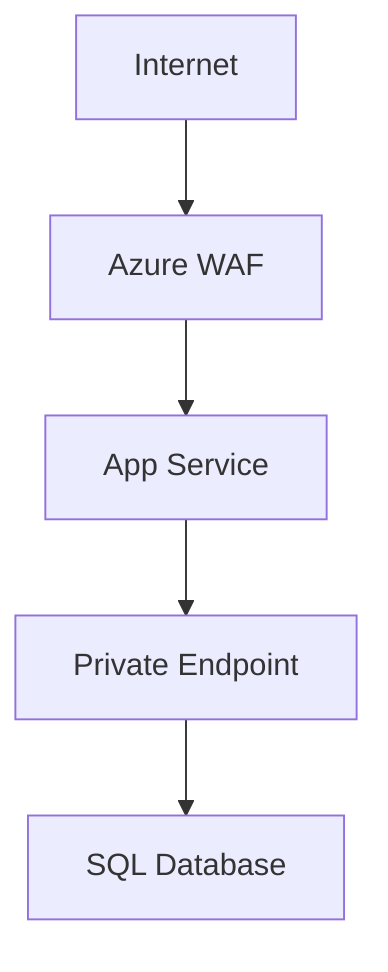

### 7. API Request Lifecycle
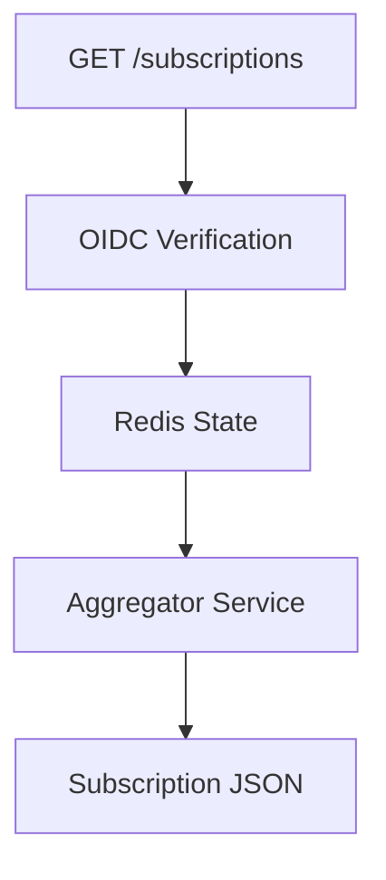

### 8. Multi-Tenant Capacity Model
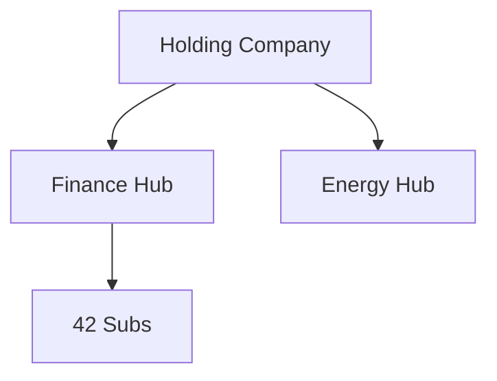

### 9. Monitoring & Observability Flow
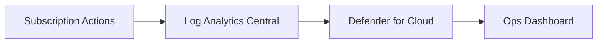

### 10. Disaster Recovery Topology
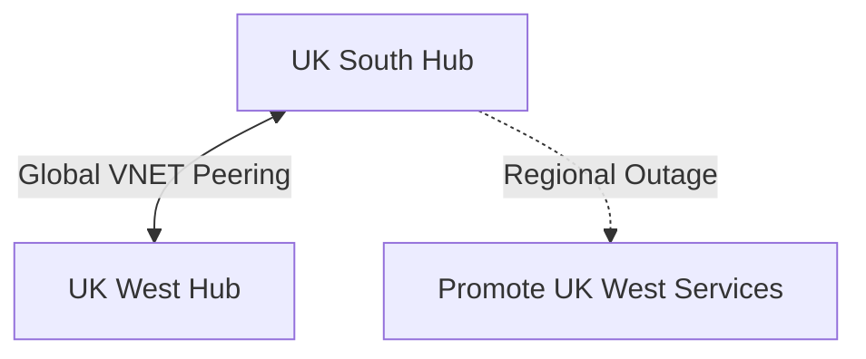

### 11. Identity Federation Model
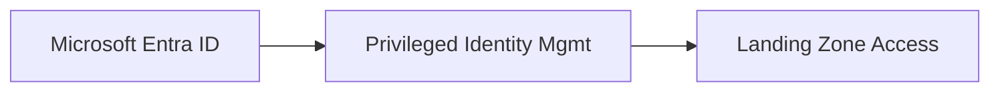

### 12. Cost Governance Workflow
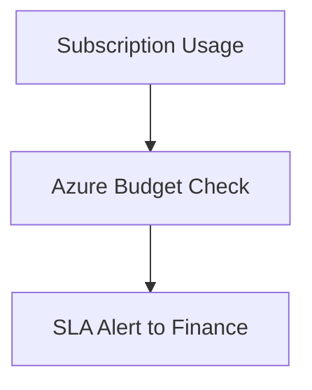

### 13. Workload Onboarding Flow
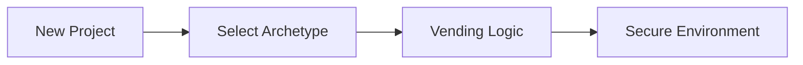

### 14. CI/CD Foundation Pipeline
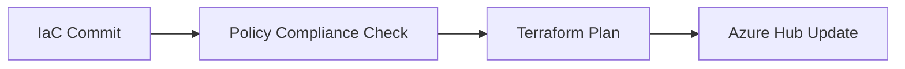

### 15. Executive Governance Workflow
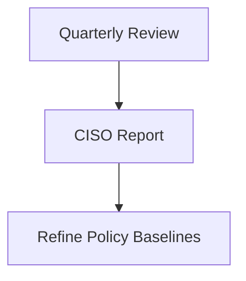

### 16. Region Expansion Model
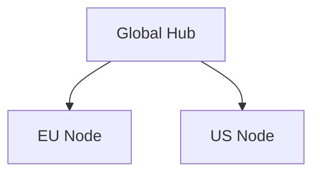

### 17. Private Endpoint Lifecycle
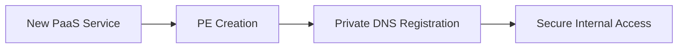

### 18. Global Region Topology
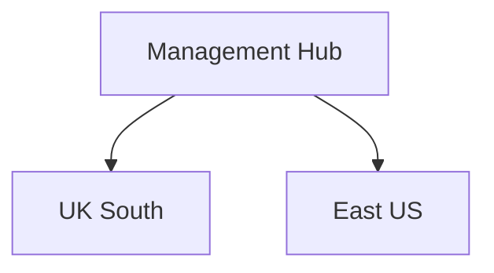

### 19. Drift Remediation Workflow
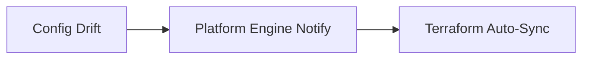

### 20. Chargeback Model
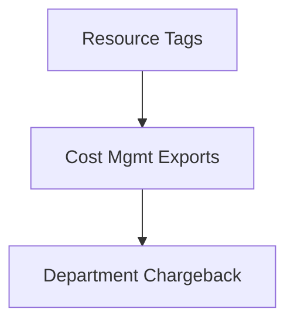

---

## 🚀 Deployment Guide

### Terraform Platform Rollout
```bash
cd terraform/environments/prd
terraform init
terraform apply -auto-approve
```

---
<sub>&copy; 2026 Devopstrio &mdash; Engineering the Scalable Foundation for the Next-Generation Enterprise Cloud.</sub>
