<div align="center">


<h1>Azure Enterprise Landing Zone Starter</h1>

<p><strong>The Institutional-Grade Platform for Standardized Cloud Foundations, Landing Zone Governance, and Multi-Cloud Platform Ecosystems.</strong></p>

[]()
[]()
[]()

<br/>

> **"Industrializing cloud foundations to automate landing zone operations."** 
> **Azure Enterprise Landing Zone Starter** is an enterprise-grade platform designed to provide a secure, measurable, and highly automated foundation for global cloud operations. It orchestrates the complex lifecycle of platform engineering—from automated subscription vending and multi-cloud policy reconciliation to high-throughput governance intelligence and unified infrastructure auditing.

</div>

---

## 🏛️ Executive Summary

Fragmented cloud perimeters and manual landing zone orchestration are strategic operational liabilities; lack of a standardized platform framework is a primary barrier to organizational engineering maturity. Organizations fail to scale their cloud estates not because of a lack of features, but because of fragmented evaluation standards, lack of automated policy reconciliation, and an inability to orchestrate platform planes with operational precision.

This platform provides the **Platform Intelligence Plane**. It implements a complete **Azure-Enterprise-Landing-Zone-Starter-as-Code Framework**, enabling CTOs and Platform Architects to manage global cloud foundations as first-class citizens. By automating the identification of governance regressions through real-time telemetry analysis and orchestrating the provisioning of secure performance-driven platform policies, we ensure that every organizational resource—from core networking hubs to edge subscription spokes—is provisioned by default, audited for history, and strictly aligned with institutional platform frameworks.

---

## 📐 Architecture Storytelling: Principal Reference Models

### 1. Principal Architecture: Global Cloud Foundation & Intelligence Plane
This diagram illustrates the high-level relationship between the Management Group Hierarchy, the Orchestration Layer (Governance, Vending, Network), and the underlying cloud foundation services. It defines the bridge between Platform Engineers and the cloud substrate.

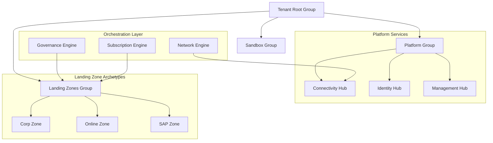

### 2. The Platform Lifecycle Flow (Subscription Vending & Onboarding)
The continuous path of a platform platform from request and archetype selection to automated subscription creation, RBAC/Policy assignment, and regional hub peering. This ensures zero-interruption operations through dependency-aware onboarding.

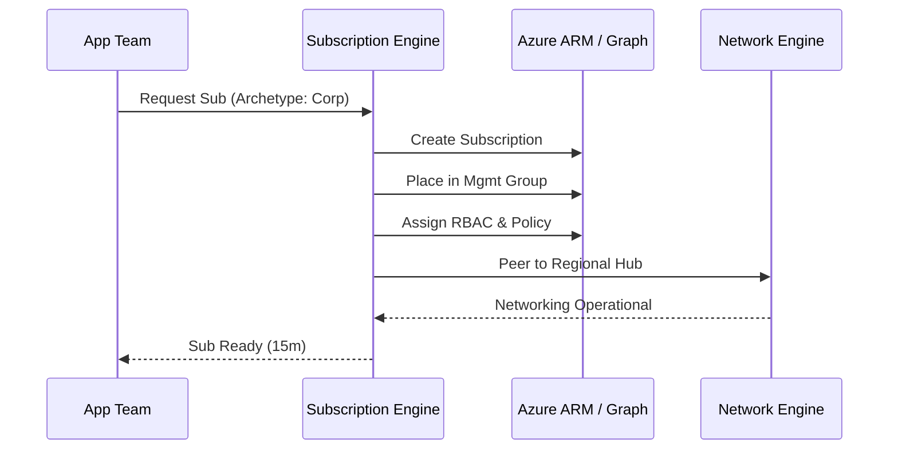

**Workload Onboarding Flow:**
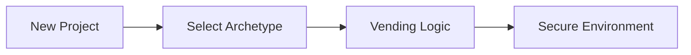

### 3. Distributed Platform Topology (Management Groups & Hub-Spoke Patterns)
Strategically orchestrating standardized platform logic across global regions and diverse resource architectures (Connectivity, Identity, Management), providing a unified institutional view of platform readiness.

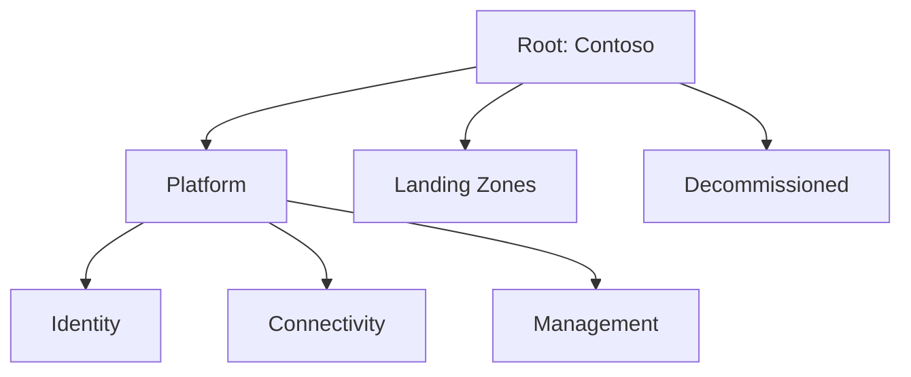

**Hub-Spoke Topology:**
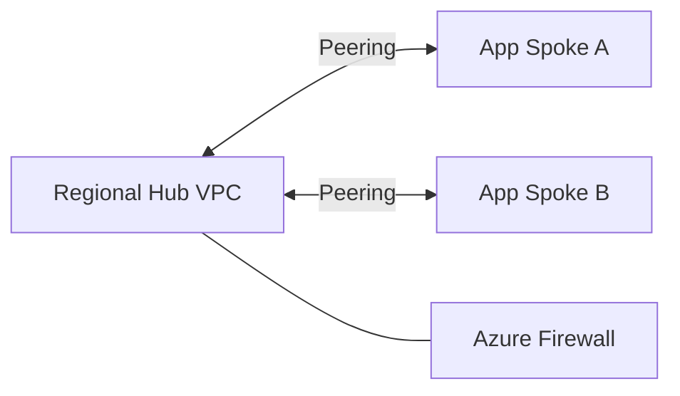

### 4. Governance Hub & Control Plane Flow
Executing complex logic for securing the bridge between platform owners and technical teams, ensuring every API request is authorized, policies are enforced, and executive oversight is maintained.

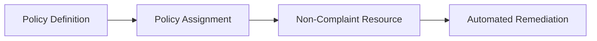

**API Request Lifecycle:**
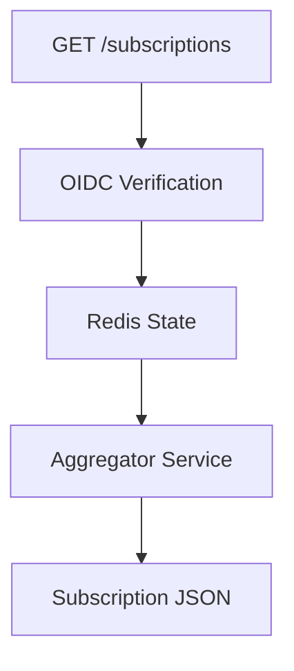

**Cost & Chargeback Workflow:**
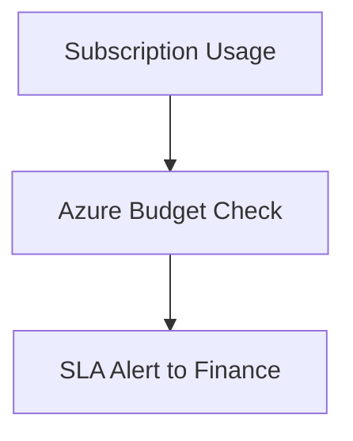

**Executive Governance Workflow:**
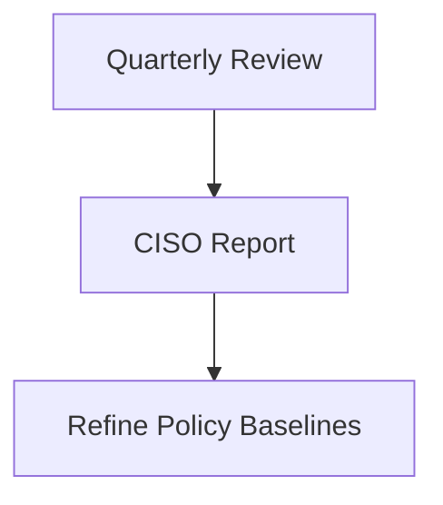

### 5. Multi-Cloud Platform Federation & Global Topology
Automatically managing unified platform standards across global regions (UK South, East US) and diverse cloud tenants, ensuring institutional data residency and privacy boundaries by default.

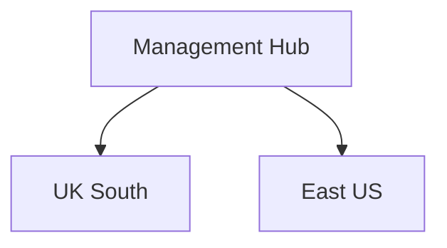

**Region Expansion Model:**
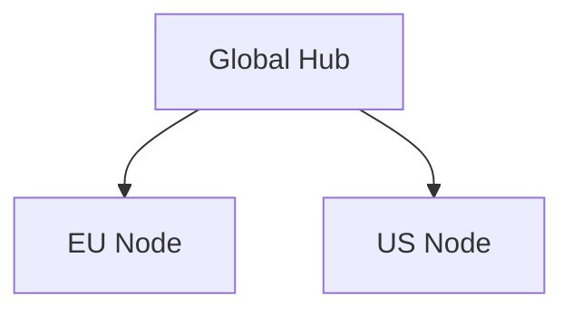

### 6. Encryption & Perimeter Protection Flow (Security Trust Boundary)
Managing the lifecycle of a platform request, automatically enforcing institutional TLS 1.3 and Private Link standards (DNS, WAF, Private Endpoints) as required by security policy, ensuring zero-latency security confidence.

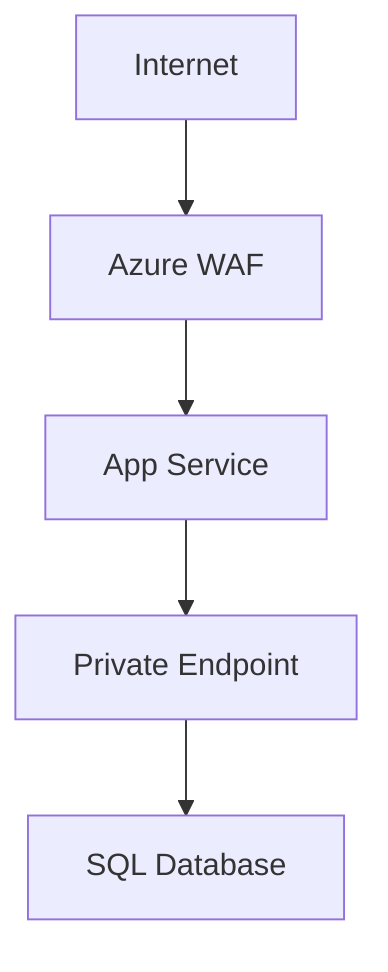

**Private Endpoint Lifecycle:**
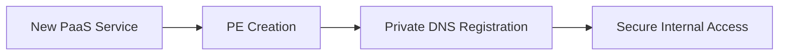

### 7. Institutional Platform Maturity Scorecard (Executive Approval)
Grading organizational performance based on key indicators: Vending Velocity, Policy Compliance Index, and Platform Adoption Scores.

**Chargeback Maturity Model:**
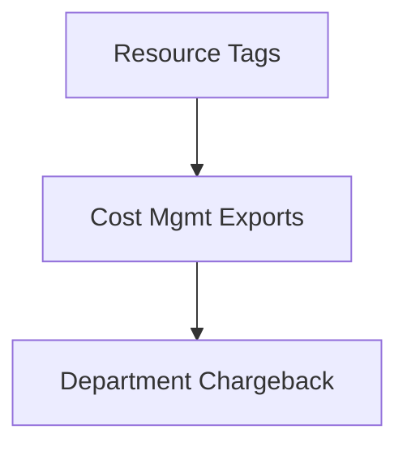

### 8. Identity & RBAC for Platform Governance
Managing fine-grained access to platform hubs, provisioning workers, and audit logs between Global Holding Companies and Business Unit hubs.

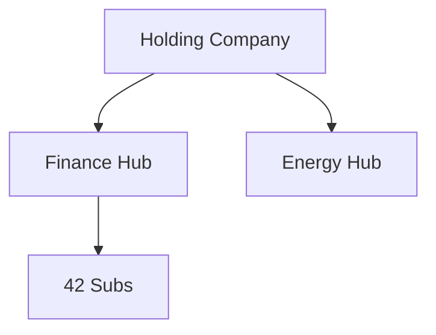

**Identity Federation Model:**
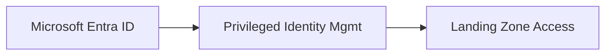

### 9. IaC Deployment: Azure-Enterprise-Landing-Zone-Starter-as-Code Framework
Using modular CI/CD pipelines to deploy and manage the versioned distribution of the platform landing zones, policy compliance checks, and global registries.

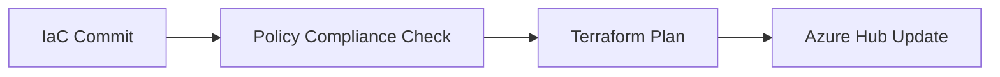

### 10. AIOps Platform Drift & Risk Validation Flow
Using advanced analytics to identify sudden surges in platform drift, unauthorized subscription creation, or unusual delivery pattern changes that could result in institutional risk or downtime.

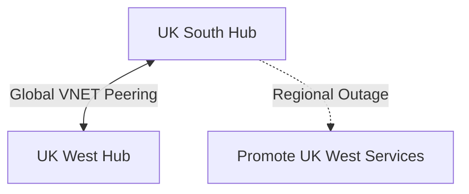

**Drift Remediation Workflow:**
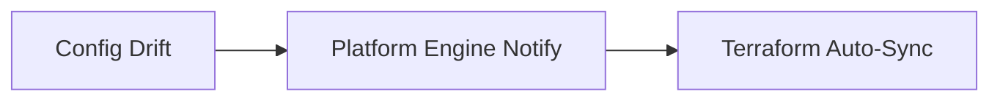

### 11. Metadata Lake for Forensic Platform Audit
Storing long-term records of every platform integration event (metadata), every subscription vended, and every monitoring telemetry for institutional record-keeping and forensic analysis.

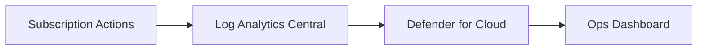

---

## 🏛️ Core Governance Pillars

1.  **Unified Foundation Coordination**: Maximizing resilience by centralizing all platform measurement through a single institutional plane.
2.  **Automated Vending Provisioning**: Eliminating "manual tracking" scenarios through proactive orchestration and pattern verification.
3.  **Sequential Platform Intelligence**: Ensuring zero-interruption operations through dependency-aware onboarding-driven data engineering.
4.  **Zero-Trust Identity Protection**: Automatically enforcing identity-based access, private link encryption, and policy evaluation across all assurance tiers.
5.  **Autonomous Operations Logic**: Guaranteeing reliability through automated industry-specific effectiveness monitoring runbooks.
6.  **Full Platform Auditability**: Immutable recording of every platform change and platform provision for institutional forensics.

---

## 🛠️ Technical Stack & Implementation

### Platform Engine & APIs
*   **Framework**: Python 3.11+ / FastAPI.
*   **Performance Engine**: Custom Python-based logic for multi-cloud subscription reconciliation and DORA-style platform metrics.
*   **Integrations**: Native connectors for Azure ARM, Graph API, and Microsoft Entra ID.
*   **Persistence**: PostgreSQL (Platform Ledger) and Redis (Live Vending State).
*   **Auth Orchestrator**: Federated OIDC/SAML for least-privilege platform management access.

### Governance Dashboard (UI)
*   **Framework**: React 18 / Vite.
*   **Theme**: Dark, Slate, Indigo (Modern high-fidelity productivity aesthetic).
*   **Visualization**: D3.js for delivery topologies and Recharts for ROI velocity analytics.

### Infrastructure & DevOps
*   **Runtime**: AWS EKS or Azure Kubernetes Service (AKS) for management plane.
*   **Measurement Hub**: Managed event sourcing for immutable productivity timeline reconstruction.
*   **IaC**: Modular Terraform for deploying the platform landing zone and validation fleet.

---

## 🏗️ IaC Mapping (Module Structure)

| Module | Purpose | Real Services |
| :--- | :--- | :--- |
| **`infrastructure/platform_hub`** | Central management plane | EKS, PostgreSQL, Redis |
| **`infrastructure/enforcers`** | Distributed vending provisioners | Azure, AWS, GCP APIs |
| **`infrastructure/vending_pipes`** | Data Ingestion Hubs | Webhooks, Lambda |
| **`infrastructure/auditing`** | Forensic modernization sinks | S3, Athena, Quicksight |

---

## 🚀 Deployment Guide

### Local Principal Environment
```bash
# Clone the Azure Enterprise Landing Zone Starter repository
git clone https://github.com/devopstrio/azure-enterprise-landing-zone-starter.git
cd azure-enterprise-landing-zone-starter

# Configure environment
cp .env.example .env

# Launch the Platform stack
make init

# Trigger a mock platform update and automated guardrail validation simulation
make simulate-vending
```

Access the Management Portal at `http://localhost:3000`.

---

## 📜 License
Distributed under the MIT License. See `LICENSE` for more information.

---
<div align="center">
  <p>© 2026 Devopstrio. All rights reserved.</p>
</div>
